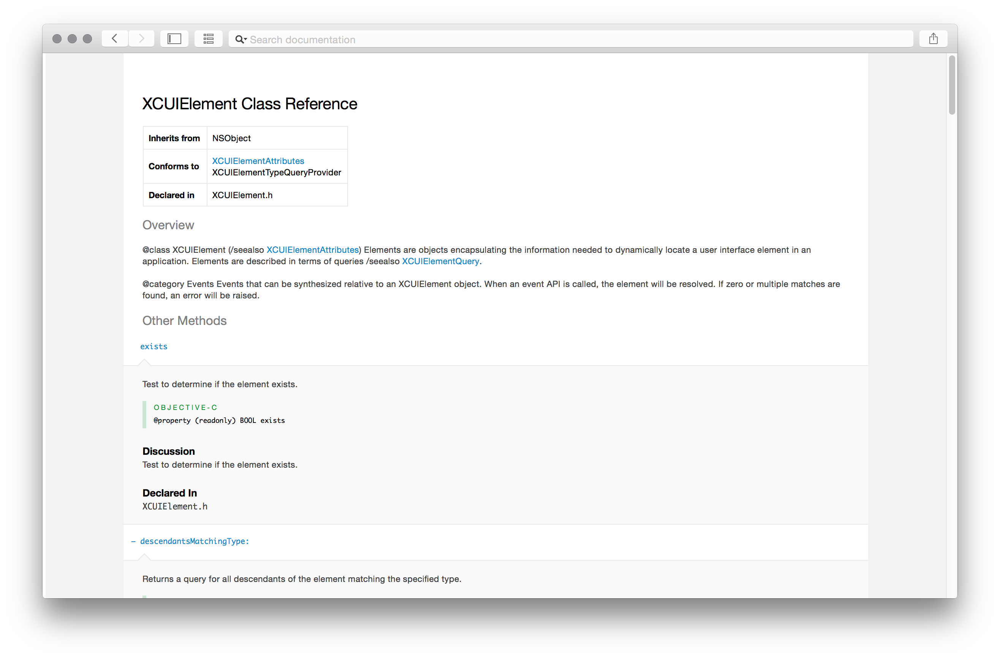
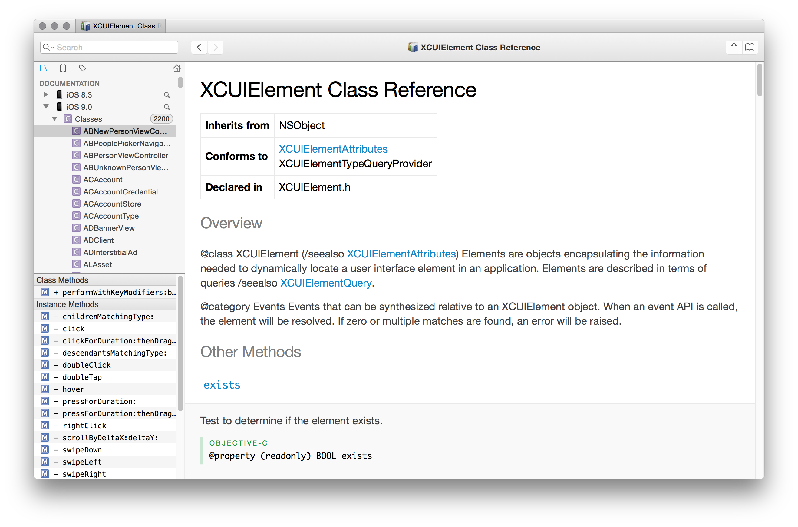

# `XCTest` Documentation - Xcode 7 GM

Unofficial documentation for `XCTest`, including UI Testing, introduced in iOS 9.

[View the documentation in your browser.](http://masilotti.com/xctest-documentation/)

## Usage

Xcode 7 Beta includes the new UI Testing framework but nothing is officially documented. This docset can be imported into Xcode 7 or Dash by cloning and opening `com.apple.XCTest.docset`.




## Generation

The docset was generated via [appledoc](https://github.com/tomaz/appledoc#readme).

```
appledoc \
--project-name "XCTest" \
--project-company "Apple" \
--company-id "com.apple" \
--output "./docset" \
--logformat xcode \
--keep-undocumented-objects \
--keep-undocumented-members \
--keep-intermediate-files \
--no-repeat-first-par \
--no-warn-invalid-crossref \
--install-docset \
"/Applications/Xcode.app/Contents/Developer/Platforms/iPhoneSimulator.platform/Developer/Library/Frameworks/XCTest.framework"
```

This will create the docset at `./docset` and install it in the shared directory:

```
~/Library/Developer/Shared/Documentation/DocSets
```
